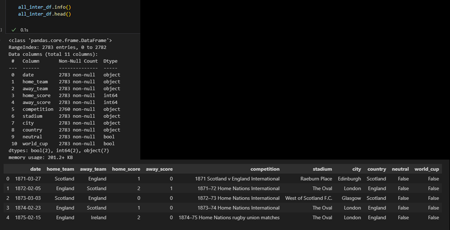
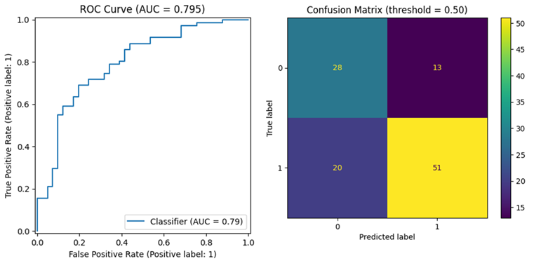

# Predicting Six Nations Rugby Match Results 

## Executive Summary

This project aims to build a predictive model to forecast match outcomes for the 2026 Six Nations Rugby Championship fixtures using only public, match-level data, producing both hard classifications (home/away win). With models trained and evaluated for accuracy. Match-level results do not identify individuals, if any player-level attributes are added later, the data will be treated as personal data and the project will follow UK GDPR principles. This project was hampered by the match level data only including generic information, with no team form/strength being included. This produced near constant probabilities for the results. Future iterations of this project should include the use of feature engineering to produce rolling form scores and an Elo rating system.

## Data Collection

The Six Nations Championship was formed in the year 2000, with the Five Nations Championship being its predecessor. Each completing team plays the opposition once during the tournament, which doesn't give a high volume of match data to build the model on. Therefore, the project used data from all international matches between the Six Nation Championship teams. The initial data source included all international rugby matches from 1871 to 2024 (Data Source One), and an additional data source being used for the 2025 Six Nations Championship results (Data Source Two). Both data sources are publicly accessible via www.kaggle.com

Data Source One - https://www.kaggle.com/datasets/lylebegbie/international-rugby-union-results-from-18712022

Data Source Two -  https://www.kaggle.com/datasets/simfour/rugby-6-nations-results-2000-2024?select=rugby_six_nations.csv

## Data Preparation

The pre-processing and preparation for this project was conducted within Python, using libraries such as pandas and numpy.
The data was first imported into a pandas data frame using the pd.read_csv function, with the initial exploration of the data set being conducted to gain the first insights.

 

 

The data was sorted by date and the index reset to ensure the match results are in chronological order.

 

As the initial data set did not include the 2025 Six Nations Championship results, a second data set was sourced, with it being imported and evaluated with the same actions as the first data set. The second data set did include previous year duplicates that were included in the first data set; therefore, the results were limited to the 2025 results only.

 

 

The two data sets were amended so that the columns and formatting match, to allow for the data to be joined together using the pd.concat() function within Python.

 

 

Points scoring within rugby union and the Six Nations Championship has developed over the years. The current points scoring system was introduced in the 1992/93 season, for the northern hemisphere. Therefore, the data for this project was limited to only include matches after September 1992.

 

 

Although the Bonus Points system was introduced in 2017, the data doesn't include where a bonus point was earned. As the bonus point isn't awarded to the match points, only table points, it doesn’t impact the match winner and isn’t required for this project. 
 
The data was checked to ensure all country names were spelt correctly, as incorrect spelling would create match ups that wouldn’t be grouped together. With the data then being limited to the Six Nations Championship teams only. These final two steps created the final data to be used within the project.

 

 

The target ‘result’ was defined from the match scores (h_w = home win, a_w = away win). Separately, the ‘matchup’ pre-match feature was engineered.

 

 

Evaluating the class balance to avoid biased performance estimates. The data shows 61.9% home wins, 36.4% away wins and 1.5% draw.

 

 

Due to the imbalance with the draw outcome variable, this outcome variable will be dropped. Keeping it in risks poor class representation, unstable training and skewed evaluation metrics.
Removing the draw results gave a distribution of 62.96% home win, 37.03% away win. With the draw result removed the ‘result’ outcome was amended to a binary outcome (1 = home win, 0 = away win), this is in line with the requirements of logistic regression.

 

## Train & Test Split

The train and test splits were created from the final data set and split 80% train data and 20% test data, with the distribution of the train and test being analysed to verify that target classes are similar in the train and test.

 

 

Correlation analysis showed strong correlation between the target variable, home win and the home_score (positive) and away_score (negative). Neutral and world_cup are highly correlated with each other and there is a risk of multicollinearity if both are included in a regression model.

 

 

To prevent target leakage, any variables revealing the result or derived from post-match data were removed (home_score, away_score, result. Data leakage occurs when information that would not be available at prediction time is used when building the model.
 
After considering the potential effect of multicollinearity seen in the data, the redundant columns of ‘neutral’ and ‘world_cup’ were also dropped.
The next step was to separate out the outcome variable that is going to be predicted, the ‘y’ variable.
 
Also, line with Logistic Regression requirements, categorical features within the data needed to be encoded to binary values.The get_dummies function was used to achieve this.

 

 

## Train The Model & Evalution

Due to slight imbalance seen within the classes, the model used a ‘balanced’ class_weights feature to mitigate the impact of this.

 

 

Evaluating the threshold-independent ranking using ROC AUC (0.795) and, given class imbalance, PR AUC (0.859 vs a 0.634 no-skill baseline), this indicates a good overall discrimination and strong precision–recall trade-offs.

 

## Model Predictions

Using the fixtures for the 2026 Six Nations Championship, table was created showing the home win probability for each match.

 

## Conclusions & Recommendations

The model has predicted a constant, almost, probability for every fixture due to each 2026 fixture row looking the same to model. When all features are constant across rows, logistic regression predicts the intercepts only. Whilst the model has predicted that all home teams will win, which represents poor performance by the model. It has created a base that can be built on for future iterations.
 
Any future iterations should include feature engineer such as a ‘team strength’ indicator, where a rolling 5 match win rate is created for each team, and an Elo rating system to be used within the model.

